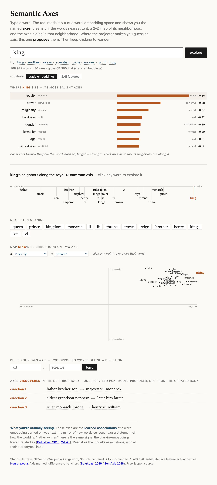

# Semantic Axes

### ▶ Live demo: https://jimdc.github.io/semantic-axes/

**Type a word — discover the named axes it loads on, then wander its neighborhood.**

Type `king` and the tool *proposes* the directions that word leans on — **royalty, power, gender** —
shows the words nearest to it, maps its neighborhood in 2-D, and surfaces the axes hiding in that
neighborhood. Click anything to re-center and keep exploring. Where the TensorFlow Embedding
Projector makes you *define* an axis (type two anchor words) and buries it in an unintuitive 3-D UI,
this one **proposes** the axes and is built for wandering.

It's a single self-contained page — vanilla JS, no framework, no build step for the front-end. The
heavy lifting (a quantized embedding + a curated axis bank) is precomputed into a few static files
the browser loads and computes on directly.



## Two substrates, one interface

A toggle switches what's *behind* the same views:

- **Static embeddings (default).** GloVe word vectors. Axes are geometric directions
  (`man − woman`, `king − queen`…). Gives you the full geometric toolkit: salient-axis bars,
  an axis spectrum, a 2-D scatter, a custom-axis builder, and unsupervised PCA discovery.
- **SAE features.** The model's *own* learned concepts, via [Neuronpedia](https://neuronpedia.org)
  sparse-autoencoder features (Gemma Scope on `gemma-2-2b`). `king` lights up "references to kings
  and royal titles"; each feature links out to Neuronpedia. A gentle on-ramp to mechanistic interpretability.

Both fill the identical `QueryResult` shape, so the front-end never changes — the substrate is a
swappable backend (`static/backend.js`).

> **Why isn't SAE coverage the full 169k?** The static substrate is unlimited because its whole
> vector table ships to the browser and the math runs locally. SAE features can't: each word needs a
> live model+SAE inference, so coverage is a **precomputed** set (the most common words) that *grows*
> toward the full vocab as you run `build_sae.py --top N` / `--all` (it's resumable). Words outside
> the set degrade to a "try these" prompt rather than an error.

## Quickstart

```sh
# 1) build the static-embedding data (needs Python + GloVe 6B, ~1 GB, once)
python3 -m venv .venv && .venv/bin/pip install numpy scikit-learn
curl -L -o data/glove.6B.zip https://nlp.stanford.edu/data/glove.6B.zip
unzip -o data/glove.6B.zip glove.6B.300d.txt -d data/
.venv/bin/python tools/build_vectors.py        # -> data/{vectors.bin,vocab.json,axes.json,meta.json}

# 2) serve and open
python3 -m http.server 8777                     # http://localhost:8777

# 3) (optional) the SAE substrate — free API key from https://neuronpedia.org
export NEURONPEDIA_API_KEY=sk-...               # or put it in .secrets.env / .env
# cleaner Gemma Scope features + broad coverage of the most common words (resumable; --all for full vocab):
SAE_MODEL=gemma-2-2b SAE_SOURCESET=gemmascope-res-16k SAE_LAYERS=20-gemmascope-res-16k \
  .venv/bin/python tools/build_sae.py --top 1500   # -> data/sae_features.json
```

> The shipped `data/vectors.bin` is ~50 MB (≈169k words). If you track it in git, use
> [Git LFS](https://git-lfs.com), or `.gitignore` it and rebuild with the command above — the build
> is deterministic.

## Suggested uses

**Teaching & learning.** A hands-on way to *see* distributional semantics — the `king − man + woman ≈
queen` geometry, what an "axis" in embedding space actually is, why words cluster. Good for NLP /
linguistics / ML-literacy classes where the projector is too fiddly.

**AI-bias literacy.** The associations are real and uncomfortable: ask the discovery mode about
`doctor` and it surfaces a gender direction — *nurse · mother* on one side, *professor · scientist*
on the other. That's the [Bolukbasi 2016](https://arxiv.org/abs/1607.06520) /
[WEAT](https://arxiv.org/abs/1608.07187) bias result falling out live, which makes it a vivid demo
for talks and workshops on how models inherit stereotypes.

**Writing & word choice.** Build a custom axis — `casual ⟷ formal`, `warm ⟷ clinical`, `art ⟷
science` — and slide a word's neighbors along *your* scale to find the one with the right
connotation. A semantic thesaurus that understands register and tone, not just synonymy.

**Interpretability on-ramp.** Flip to the SAE substrate to see which of a model's learned features
fire on a word, then click through to Neuronpedia. A low-friction first taste of mechanistic interp.

**Quick research probe.** Sanity-check an embedding space, eyeball analogies, or prototype a named
axis before writing any code — the axis bank is editable JSON (`tools/axis_bank.json`).

**Naming, branding, worldbuilding.** Explore the connotation neighborhood of a name or coined word;
measure candidates on a homemade `premium ⟷ budget` or `playful ⟷ serious` ruler.

**Word games & curiosity.** Neighbor-hopping is just fun — and the discovery mode quietly exposes
polysemy (`wolf` splits into the animal *dog · beaver · eagle* and the surname *blitzer · markus*).

## Ideas to extend / fork

- **Swap the embeddings.** Drop in domain vectors (legal, medical, financial), historical embeddings,
  or another language — `build_vectors.py` takes any GloVe-format file.
- **Better SAEs.** Point `build_sae.py` at `gemma-2-2b` + Gemma Scope (`SAE_MODEL` / `SAE_SOURCESET`)
  for cleaner, more semantic features than gpt2-small.
- **Phrase mode.** Use sentence-transformer embeddings to explore short phrases, not just words.
- **Grow the axis bank.** Add axes (each is a few anchor pairs) — the discovery mode will start
  labeling neighborhood directions with them.

## How it works

- **Vectors.** GloVe 6B (300-d); the ~169k most frequent clean tokens are mean-centered →
  L2-normalized → int8-quantized. The browser computes on the int8 bytes directly (no float copy),
  so memory ≈ download size. Every dot product is a cosine in [−1, 1].
- **Axes.** Each bank axis is `unit(mean over pairs of (v(pos) − v(neg)))`
  ([Bolukbasi 2016](https://arxiv.org/abs/1607.06520) / [SemAxis 2018](https://arxiv.org/abs/1806.05521)).
  A word's position is the centered dot product; "salient axes" = the bank ranked by |projection|.
- **Discovery.** Local PCA over a word's neighborhood finds directions the bank never named; each is
  labeled by its nearest bank axis (when there's a real resemblance) and its extreme words.
- **SAE.** `build_sae.py` calls Neuronpedia `/api/search-all` per word (default Gemma Scope
  `gemma-2-2b`, layer 20) and stores the top features + explanations; the browser reads that JSON. The
  run is resumable/mergeable, so coverage grows toward `--all` (full static↔SAE symmetry). No key or
  cross-origin call ever happens client-side.

## What you're seeing (honesty)

These axes are **learned associations**, not ground truth — a mirror of how words co-occur in the
training text, stereotypes and all. The UI says so on the page. Treat "father ↔ man" as *the model's*
association, not a fact about the world.

## Limitations

- GloVe (2014) collapses polysemy (`king` the monarch vs the chess piece are one point) and is frozen
  in its era's usage; the SAE substrate is contextual but covers only a precomputed word set (growable),
  and a bare single word can yield generic features.
- Analogy arithmetic is shakier than the famous demos suggest, and PCA-discovered axes are
  sample-dependent — they're suggestive, not authoritative (the UI hedges them).
- Proper nouns and rare tokens leak into neighborhoods.

## Layout

```
index.html            single-page app
static/
  embed.js            load vectors + axis bank; vector math (int8 dot, cosine kNN, projection, local PCA)
  backend.js          the SemanticBackend seam: StaticEmbeddingBackend + SAEBackend
  vis.js              canvas: diverging axis bars · axis spectrum · two-axis scatter
  app.js              state + render loop + events + URL-hash state + substrate toggle
  styles.css          minimal, data-dense
tools/
  build_vectors.py    GloVe -> quantized vectors + axis bank  (numpy/sklearn)
  build_sae.py        Neuronpedia SAE features per word
  axis_bank.json      the curated named-axis definitions (edit freely)
data/                 shipped artifacts: vectors.bin, vocab.json, axes.json, meta.json, sae_features.json
tests/browser/        playwright smoke test + screenshots
```

## Credits & licence

[GloVe](https://nlp.stanford.edu/projects/glove/) (Pennington et al., Stanford NLP). SAE features and
explanations via [Neuronpedia](https://neuronpedia.org). Axis method:
[Bolukbasi et al. 2016](https://arxiv.org/abs/1607.06520);
[An et al. (SemAxis) 2018](https://arxiv.org/abs/1806.05521);
[Caliskan et al. (WEAT) 2017](https://arxiv.org/abs/1608.07187).
Code MIT-licensed; the GloVe vectors and Neuronpedia data carry their own terms.
